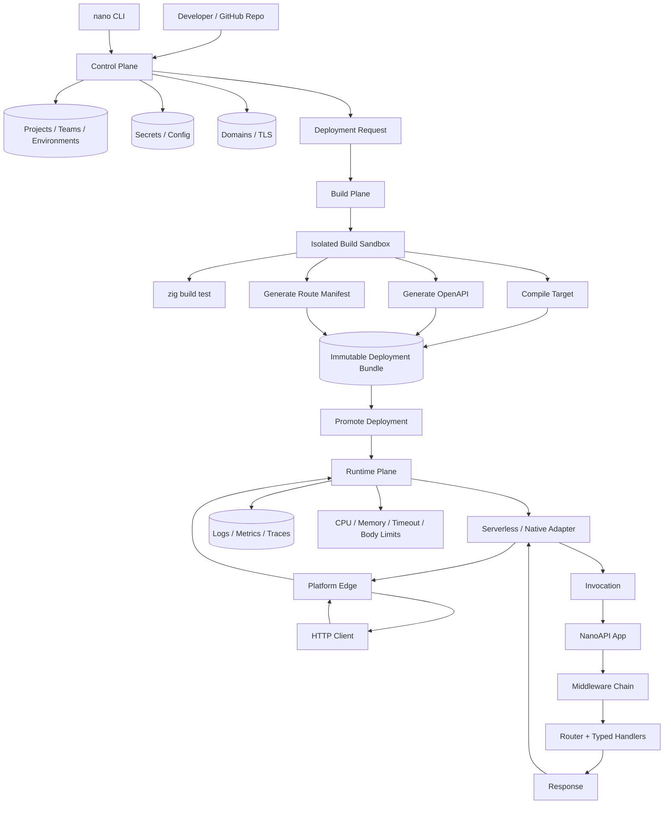

# NanoAPI Architecture

This document describes the target shape for NanoAPI as a framework that can run
the same app through a native HTTP server or through serverless adapters.

## Core Boundary

NanoAPI's stable runtime boundary is:

```zig
Request -> middleware chain -> router -> Response
```

The native HTTP server, tests, and future serverless adapters should all enter
through this same boundary. That keeps route behavior, middleware, typed parsing,
OpenAPI metadata, uploads, streaming helpers, and validation consistent across
deployment targets.

The native server owns sockets and HTTP/1.1 parsing. Serverless adapters should
own platform event decoding and platform response encoding only.

## Serverless Contract

The initial serverless layer lives in `src/serverless.zig`.

```zig
pub const Invocation = struct {
    method: []const u8,
    target: []const u8,
    path: []const u8,
    query_string: []const u8,
    headers: []const HeaderPair,
    body: []const u8,
};
```

`serverless.handle()` converts an invocation into a normal `Request` and calls
`app.handle()`. `serverless.handleBytes()` additionally collects byte responses
into an owned `ServerlessResponse` for platforms that expect a JSON-like
response envelope.

The first version intentionally supports byte responses for collection. File and
stream responses should stay represented as native `Response` values until a
specific platform adapter can map them safely.

## Adapter Targets

Adapters should be thin modules over `serverless.Invocation`:

- `serverless.aws_http_v2`: API Gateway HTTP API and Lambda Function URL payload
  format 2.0. The first version is implemented and supports JSON event decode,
  base64 request-body decode, byte-response collection, response JSON encode,
  and v2 response cookies.
- `serverless.fetch`: Fetch-style `Request -> Response` for edge/WASM runtimes
  such as Cloudflare Workers.
- `serverless.cloudevents`: event-trigger adapter for queues, cron, storage
  events, and background workflows.

Each adapter should do three things:

- parse the platform event into `Invocation`
- call `serverless.handle()` or `serverless.handleBytes()`
- encode the platform response format

No adapter should duplicate routing or middleware logic.

## Whole-App And Per-Route Deployments

NanoAPI should support two serverless deployment modes.

Whole-app mode:

- one function entrypoint owns the full app
- all routes are dispatched by NanoAPI
- middleware and OpenAPI behavior are identical to the native server
- this should be the first production target

Per-route mode:

- build tooling emits one function per route
- useful for platforms that scale or secure each route independently
- requires a generated manifest from registered route metadata
- should come after whole-app mode is stable

## Route Manifest

A future `nanoapi manifest` command can emit a route manifest:

```json
{
  "runtime": "nanoapi",
  "version": 1,
  "routes": [
    {
      "method": "GET",
      "path": "/users/{user_id}",
      "operationId": "get_user",
      "entrypoint": "src/main.zig",
      "mode": "app"
    }
  ]
}
```

The manifest should be derived from the same route registry used by OpenAPI.
It should not become a second source of truth.

## Infrastructure Layout

Generated infrastructure should be kept out of the core framework. A future
project using NanoAPI can use a layout like:

```text
infra/
  aws/
    template.yaml
    lambda_http_v2.zig
  cloudflare/
    wrangler.toml
    worker.zig
  terraform/
    main.tf
```

Generated build artifacts are ignored in `.gitignore`:

- `.aws-sam/`
- `.serverless/`
- `.terraform/`
- `.wrangler/`
- `.vercel/`
- `.netlify/`
- `cdk.out/`
- `terraform.tfstate*`

Source infrastructure files such as `template.yaml`, `main.tf`, or
`wrangler.toml` should generally be tracked by applications, not ignored by the
framework.

## NanoAPI As A Hosted Service

NanoAPI can also become a hosted platform where users bring an application repo
and NanoAPI builds, deploys, and runs it for them. This should be treated as a
separate product layer over the framework, not as framework code mixed into
request handling.

The hosted service should have three planes:

- Control plane: projects, teams, environments, domains, secrets, deployments,
  billing, audit logs, and deployment state.
- Build plane: isolated workers that fetch source, resolve Zig dependencies,
  run tests, compile artifacts, generate route manifests, and publish immutable
  deployment bundles.
- Runtime plane: edge/serverless/native workers that receive HTTP traffic and
  execute a pinned deployment through the same `Invocation -> App -> Response`
  boundary.



The developer experience can look like:

```bash
nano login
nano init
nano deploy --project api --env prod
nano domains add api.example.com
nano logs --tail
```

At deploy time, the service should:

1. Clone or receive the user's source.
2. Run `zig build test`.
3. Build the selected target, such as AWS Lambda, Fetch/WASM, or native Linux.
4. Generate an OpenAPI document and route manifest.
5. Store an immutable bundle identified by a deployment id.
6. Promote the deployment to an environment after health checks pass.

The route manifest becomes important for hosted operation:

- routing previews before deploy
- per-route analytics
- per-route auth and rate limit policies
- future per-route function splitting
- OpenAPI docs and SDK generation

Tenant isolation should be a first-class design constraint:

- builds run in short-lived sandboxes with no shared writable state
- runtime deployments have per-project CPU, memory, body-size, and timeout limits
- secrets are injected at runtime and never written into build artifacts
- custom domains terminate TLS at the platform edge
- logs and traces are tagged by project, environment, deployment, and route

The hosted service should expose platform features through config, not through a
different application API. A future `nanoapi.toml` could describe deployment
intent:

```toml
name = "example-api"

[build]
target = "aws_http_v2"
command = "zig build -Doptimize=ReleaseFast"

[deploy.production]
regions = ["us-east-1"]
min_instances = 0
max_body_size = "10mb"
timeout = "30s"

[[domains]]
hostname = "api.example.com"
environment = "production"
```

Runtime feature targets:

- static and JSON APIs through buffered responses
- SSE and LLM token streams where the selected platform supports streaming
- file uploads with size limits and optional object-storage spooling
- file responses through object storage or platform sendfile equivalents
- background jobs through CloudEvents-compatible invocations

This platform should not require users to rewrite their application. The same
`NanoAPI` app should run locally with the native server and in the hosted service
with a serverless adapter.

Initial product scope should stay narrow:

1. GitHub-connected projects.
2. One whole-app deployment per environment.
3. AWS HTTP API v2 / Lambda Function URL runtime.
4. OpenAPI publishing per deployment.
5. Logs, environment variables, and custom domains.

Later scope can add:

- Fetch/WASM edge runtime
- per-route function splitting
- build cache and dependency cache
- managed databases/object storage bindings
- team billing and usage limits
- generated clients from OpenAPI
- marketplace templates

## Standards

There is no single PEP-style standard that describes all serverless HTTP routes.
NanoAPI should align with these existing standards where they fit:

- OpenAPI 3.1 for describing HTTP APIs and route metadata.
- Fetch `Request`/`Response` concepts for edge/serverless HTTP shape.
- ASGI as a useful design reference for app/server separation and streaming.
- PEP 3333 / WSGI as historical precedent for a simple app/server gateway.
- CloudEvents for non-HTTP serverless events.

OpenAPI remains the external route contract. `serverless.Invocation` is the
internal adapter contract.

## Streaming And Uploads

Serverless streaming differs by platform:

- native server: chunked transfer and SSE are already supported
- Lambda Function URLs: response streaming needs a dedicated adapter
- API Gateway HTTP API: buffered responses only
- Fetch-style edge runtimes: streams can map more directly to platform streams

Uploads also differ by platform. The core request parser supports in-memory
multipart and URL-encoded form parsing. Production adapters should add body size
limits and temporary-file spooling before supporting large uploads.

## Near-Term Work

1. Add a small AWS Lambda Function URL example app.
2. Add Fetch-style adapter shape for edge/WASM runtimes.
3. Add route manifest generation from `APIRouter.routes()`.
4. Add adapter-specific tests for binary responses and multi-value headers.
5. Add request cookie array handling for AWS HTTP API v2 events.
6. Add platform streaming adapters once the byte-response path is stable.
