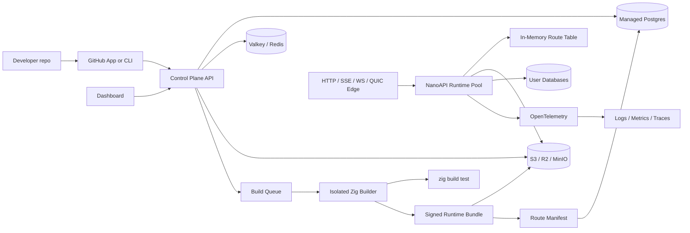
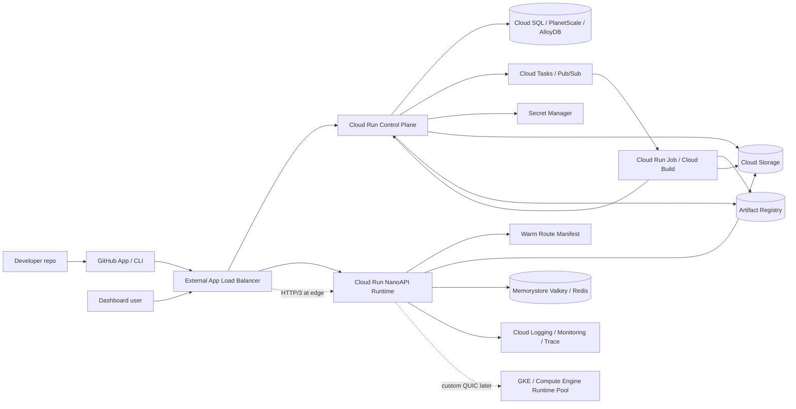
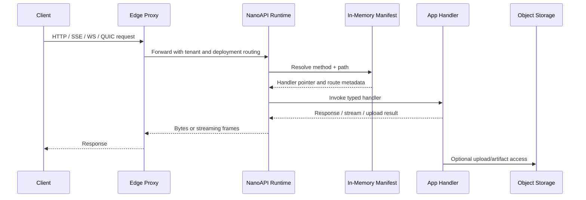
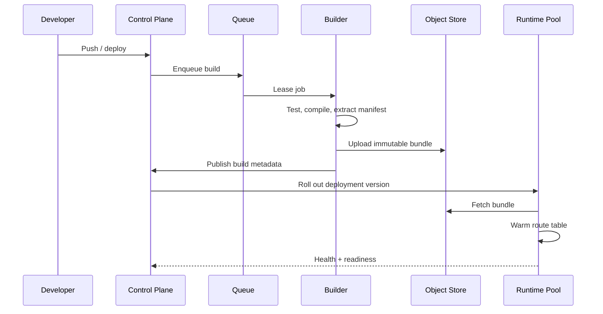

# NanoAPI Infrastructure Architecture

This folder is intentionally ignored by git. Use it as the working area for infrastructure design, deployment notes, experiments, provider comparisons, and private assumptions before anything becomes public documentation.

## Current Recommendation

Start with a managed control plane and keep the runtime portable.

- Let GCP manage the first hosted MVP where it removes operational work: load balancing, TLS, autoscaling HTTP services, build jobs, secrets, artifact storage, object storage, logs, metrics, and regional failover primitives.
- Use PlanetScale Postgres for the hosted NanoAPI control-plane database if pricing and region fit. It is managed Postgres, supports HA production clusters, replicas, backups, branching, query insight tooling, and PgBouncer-style pooling.
- If we want one-cloud simplicity, use Cloud SQL for PostgreSQL first; move to AlloyDB only if the control plane becomes a demanding transactional or analytical workload.
- Keep the schema standard PostgreSQL and avoid provider-specific features in the first pass, so we can move to RDS, Neon, Supabase, Crunchy, CloudNativePG, or Patroni later.
- Do not put hot request routing in Postgres. The runtime should load immutable deployment manifests into memory and only call the control plane for deploys, configuration refreshes, billing, audit, and operational metadata.
- Treat bare metal as the sovereignty/performance path, not the fastest path to a hosted MVP.

## Product Shape

NanoAPI as a service should separate four planes:

- Control plane: tenants, users, projects, environments, deployments, domains, certificates, secrets, billing, audit logs, and route manifests.
- Build plane: checkout, dependency resolution, `zig build test`, target compilation, route extraction, artifact signing, SBOM generation, and immutable bundle upload.
- Runtime plane: fast NanoAPI workers that run bundles, stream responses, accept file uploads, and expose HTTP/SSE/WebSocket/QUIC entrypoints.
- Data plane: Postgres for metadata, object storage for artifacts/uploads, Valkey or Redis for queues/cache/rate limits, and observability storage for traces/logs/metrics.



## MVP Stack

This gets us to a real hosted service without committing to heavy orchestration too early:

- Edge: GCP global external Application Load Balancer, Certificate Manager, and Cloud Armor.
- Control plane: Cloud Run service.
- HTTP runtime: Cloud Run service running the NanoAPI native binary.
- Long-lived realtime runtime: Cloud Run first for SSE/WebSockets with reconnect semantics; move to GKE or Compute Engine for indefinite connections or custom transport needs.
- QUIC/HTTP/3: let the GCP load balancer terminate HTTP/3 for normal web traffic; use GKE or VMs when NanoAPI needs backend-controlled QUIC streams/datagrams.
- Builder: Cloud Run Jobs or Cloud Build, with isolated service accounts and no long-lived credentials.
- Database: Cloud SQL for PostgreSQL for one-cloud simplicity, PlanetScale Postgres for provider-independent managed Postgres, AlloyDB only when the workload justifies the cost and platform coupling.
- Queue/cache: Pub/Sub or Cloud Tasks for durable jobs; Memorystore for Valkey/Redis when we need fast ephemeral coordination.
- Object storage: Cloud Storage for build artifacts, upload spooling, deployment bundles, and logs.
- Secrets: Secret Manager.
- Observability: Cloud Logging, Cloud Monitoring, Cloud Trace, and OpenTelemetry export from NanoAPI.

## Managed GCP Path

The pragmatic hosted path is to let GCP own the undifferentiated infrastructure and keep NanoAPI focused on the fast runtime, typed route model, deployment bundle format, and serverless adapters.



Use Cloud Run for:

- Control-plane API.
- Dashboard backend.
- Standard HTTP APIs.
- SSE and LLM streaming endpoints that can tolerate reconnects.
- WebSockets where one-hour request ceilings and stateless autoscaling are acceptable.
- Builder callbacks and small internal services.

Use Cloud Run Jobs or Cloud Build for:

- Zig build/test.
- Route manifest extraction.
- Bundle signing.
- SBOM generation.
- Artifact upload.

Zig on Cloud Run:

- Cloud Run does not need a first-class Zig language runtime for NanoAPI.
- Deploy NanoAPI as a container image containing a Linux x86_64 Zig binary.
- The ingress container must listen on `0.0.0.0:$PORT`; Cloud Run injects `PORT`.
- Do not terminate TLS inside NanoAPI on Cloud Run; TLS terminates at Cloud Run or the external load balancer.
- Source-based Cloud Run buildpacks may not support Zig directly, so use a Dockerfile or Cloud Build step that runs `zig build`.
- For Apple Silicon development machines, build the image/binary for `linux/amd64` unless we later validate another supported Cloud Run architecture.

Example container shape:

```dockerfile
FROM alpine:3.20 AS build
RUN apk add --no-cache curl xz build-base
# Install pinned Zig here, or use a maintained Zig builder image.
WORKDIR /src
COPY . .
RUN zig build -Doptimize=ReleaseFast -Dtarget=x86_64-linux-musl

FROM gcr.io/distroless/static-debian12
COPY --from=build /src/zig-out/bin/nanoapi /nanoapi
ENV PORT=8080
CMD ["/nanoapi"]
```

Use GKE or Compute Engine when:

- We need backend-controlled QUIC, custom UDP, or transport experiments.
- WebSockets need to be effectively indefinite rather than timeout/reconnect based.
- Runtime workers need pinned CPU, lower scheduling variance, custom kernel/network tuning, or sidecar-heavy routing.
- Tenant isolation requires Firecracker, gVisor tuning, cgroup details, or nonstandard sandboxing.

Decision: use GCP-managed services for the first hosted service, but design every internal contract so the same runtime can run on bare metal later.

## Region Model

Cloud Run resources live in a selected region, so a single Cloud Run service is regional, not magically global. The edge can still be global.

Recommended launch shape:

- Start in one primary region, probably `us-central1` for lowest cost/default examples or `asia-southeast1` if we want the first deployment close to Singapore.
- Put a global external Application Load Balancer in front of the runtime.
- Use one regional Cloud Run runtime behind a serverless NEG at first.
- Keep Postgres, object storage, build jobs, and runtime in the same region where possible to avoid latency and cross-region data transfer.
- Store each deployment with a `region` or `regions` field from day one, even if launch only supports one region.

Multi-region shape:

- Deploy equivalent Cloud Run runtimes in multiple regions.
- Attach one serverless NEG per region to the global load balancer backend.
- Use Cloud Run multi-region services or manage separate regional services ourselves.
- Keep route manifests and bundles replicated to the regions that serve them.
- Use a primary control-plane database first; add read replicas or regional caches only when needed.

Do not start multi-region unless a customer needs latency, data residency, or availability guarantees. It makes custom domains, deploy rollouts, usage metering, logs, cache invalidation, and incident handling more complicated.

## Custom Domains

Use one shared edge and make custom domains a control-plane concern.

Recommended GCP implementation:

- Put a global external Application Load Balancer in front of the Cloud Run runtime.
- Use a static global IPv4 address, and optionally IPv6.
- Use Certificate Manager with Google-managed certificates.
- Use DNS authorization for customer domains so certificates can be provisioned before traffic is moved.
- Use certificate maps to select the right certificate by SNI.
- Send all custom-domain traffic to the same NanoAPI runtime backend.
- Resolve tenant/project/environment/deployment by `Host` inside NanoAPI using the warm control-plane domain map.
- Avoid Cloud Run direct domain mappings for production; they are preview, have production caveats, and do not support wildcard certificates.

Customer onboarding flow:

1. User adds `api.customer.com` or `*.customer.com` to a NanoAPI project environment.
2. Control plane creates a domain row with status `pending_verification`.
3. Control plane generates DNS instructions:
   - Verification CNAME for Certificate Manager DNS authorization.
   - Traffic record: `CNAME api.customer.com -> edge.nanoapi.dev` for subdomains, or `A/AAAA` records to the global load-balancer IP for apex domains.
4. User updates DNS at their registrar or DNS provider.
5. Domain verifier checks DNS propagation and Certificate Manager authorization.
6. Control plane provisions or updates a Google-managed certificate.
7. Control plane creates or updates a certificate-map entry for the hostname.
8. Runtime receives the domain map update and begins routing the host to the active deployment.
9. Status becomes `active`.

Data model:

- `custom_domains`
  - `id`
  - `tenant_id`
  - `project_id`
  - `environment_id`
  - `hostname`
  - `kind`: `subdomain`, `apex`, `wildcard`
  - `status`: `pending_verification`, `provisioning_certificate`, `active`, `failed`, `disabled`
  - `dns_target`
  - `verification_name`
  - `verification_value`
  - `certificate_provider`
  - `certificate_resource`
  - `certificate_map_entry`
  - `active_deployment_id`
  - `last_checked_at`
  - `failure_reason`

Operational notes:

- Prefer customer subdomains because `CNAME` onboarding is simple.
- Apex domains need `A/AAAA` records to our global static IP, unless the DNS provider supports `ALIAS` or `ANAME`.
- Wildcard customer domains require DNS authorization and only cover one subdomain level.
- Shard certificates because Google-managed certificates have SAN limits.
- Keep the runtime host lookup in memory. Do not query Postgres on the request path.
- Add a grace period before deleting certificate resources after a customer removes a domain.
- For self-hosted or bare-metal installs, use the same `custom_domains` model but replace Certificate Manager with ACME DNS-01 or HTTP-01 automation.

## GCP vs AWS Cost Posture

The honest answer is workload-dependent, but for NanoAPI's first hosted version GCP is likely cheaper to operate and easier to reason about.

GCP advantages for this product shape:

- Cloud Run can scale to zero and has a recurring free tier.
- Cloud Run supports high concurrency, so many requests can share one warm NanoAPI process.
- The external Application Load Balancer adds a forwarding-rule cost and data-processing cost, not an API Gateway-style per-request tax for normal HTTP.
- Google-managed SSL certificates are free on Cloud Load Balancing.
- The one-cloud path is simple: Cloud Run, Cloud Run Jobs, Cloud Storage, Secret Manager, Cloud SQL, Cloud Logging, and one global load balancer.

AWS advantages:

- Lambda plus HTTP API can be very cheap at low traffic, especially with short requests and no always-on runtime.
- API Gateway has first-class custom domain routing and WebSocket APIs.
- ALB plus ECS/Fargate/EC2 can become cost-effective for steady high-throughput services.
- AWS has mature primitives for Route 53, ACM, CloudFront, API Gateway, ALB, NLB, Lambda, ECS, and EKS.

Cost traps:

- On GCP, a global external Application Load Balancer has an always-on forwarding-rule cost even if Cloud Run scales to zero.
- On AWS, API Gateway adds a per-request cost on top of Lambda compute.
- AWS ALB adds hourly, LCU, data transfer, and public IPv4 charges.
- WebSockets and long-lived streams are not free on either platform; Cloud Run bills active instances, while API Gateway WebSockets bills messages and connection minutes.
- At high sustained RPS, managed serverless convenience can lose to a tuned VM/GKE/ECS runtime pool.

Decision for now:

- Use GCP for the hosted MVP.
- Use one global external Application Load Balancer and Cloud Run runtime backend.
- Keep AWS as a supported adapter target, not the first infrastructure substrate.
- Re-run the cost model once we have real numbers for average request duration, response size, monthly requests, WebSocket minutes, builder minutes, and upload volume.

## Bare Metal Path

Bare metal should be designed as a deployment target with the same contracts as the hosted platform.

Phase 1: single node

- Ubuntu/Debian host with systemd units.
- Caddy or HAProxy terminates TLS.
- NanoAPI control plane and runtime workers run as separate services.
- Postgres runs locally with WAL archiving enabled.
- MinIO stores artifacts and upload objects.
- Valkey handles queue/cache/rate limiting.
- Prometheus node exporter, journald forwarding, and basic uptime probes.

Phase 2: small HA cluster

- Three or more nodes.
- k3s for scheduling if Kubernetes compatibility matters; Nomad if we want simpler ops and tighter VM/bare-metal ergonomics.
- HAProxy or Envoy in front of the cluster.
- CloudNativePG or Patroni for Postgres HA.
- pgBackRest or WAL-G for backups and point-in-time restore.
- MinIO distributed mode or external S3-compatible storage.
- Per-tenant runtime isolation through Linux users, cgroups, namespaces, seccomp, and eventually Firecracker if untrusted user code runs on our machines.

Phase 3: regional platform

- Separate control-plane and runtime clusters.
- Multi-AZ or multi-rack placement.
- Object storage replicated across failure domains.
- Read replicas for control-plane reporting and analytics.
- Queue partitioning by region and tenant class.
- Runtime admission control, per-tenant quotas, and noisy-neighbor protection.

## Orchestration Decision

Use the smallest orchestrator that matches the current failure mode.

- systemd is enough for one-node internal alpha deployments.
- Docker Compose is useful for local integration but should not be the production primitive.
- k3s is the best default for bare-metal clusters because it keeps Kubernetes compatibility without the operational weight of a full managed cluster.
- Nomad remains a strong option if we choose simpler scheduling, easier binary deployment, and fewer Kubernetes abstractions.
- Managed Kubernetes is only worth it once we need autoscaling, cloud load balancers, node pools, and managed operational integrations.

Recommended progression:

1. Cloud Run control plane and HTTP runtime for hosted dogfooding.
2. Cloud Run Jobs or Cloud Build for builder isolation.
3. GCP external Application Load Balancer for TLS, domains, HTTP/3 at the edge, and routing.
4. GKE or Compute Engine runtime pool for custom QUIC, indefinite WebSockets, and lower-level performance work.
5. k3s or Nomad bare-metal path for customers who want to self-host.
6. Optional bare-metal SKU using the same deployment bundle, manifest, and runtime contracts.

## Request Path

The hot path should not touch the control-plane database.



## Deployment Lifecycle



## Serverless Route Model

NanoAPI can support "serverless" routes without becoming tied to one provider by making the invocation ABI ours.

- Route packages compile to a NanoAPI deployment bundle.
- Each bundle exports a route manifest, typed request/response contracts, middleware chain metadata, and runtime capability requirements.
- Provider adapters translate AWS HTTP API v2, Lambda Function URLs, Cloudflare Workers-style Fetch, Vercel-like functions, or future WASM hosts into the same NanoAPI invocation shape.
- The runtime decides whether a route is always-on, scale-to-zero, isolated per tenant, or pinned to a warm worker pool.
- Streaming routes must declare whether they need chunked HTTP, SSE, WebSockets, or QUIC datagrams/streams.

## Data Model Sketch

Control-plane tables:

- `tenants`
- `users`
- `memberships`
- `projects`
- `environments`
- `deployments`
- `deployment_artifacts`
- `route_manifests`
- `domains`
- `certificates`
- `secrets`
- `runtime_regions`
- `runtime_instances`
- `usage_events`
- `audit_events`

Runtime-local state:

- Active deployment ID per tenant/project/environment.
- Route lookup table.
- Middleware chain.
- Header and path parameter metadata.
- Rate-limit counters.
- Upload/session stream state.

## PlanetScale Postgres Decision

Use it for the first hosted control plane if we want a managed Postgres with good operational defaults.

Reasons to use it:

- It is PostgreSQL-compatible and managed.
- Production clusters can run in a highly available primary/replica topology across availability zones.
- It includes operational pieces we would otherwise build early: backups, branching, monitoring/query insight, scaling controls, and pooling options.
- The low-end managed Postgres pricing is cheap enough for an MVP, while Metal gives a higher-performance path if the control plane ever becomes I/O-heavy.

Reasons to stay portable:

- NanoAPI should not require one vendor to self-host.
- The runtime hot path should be fast without database access.
- Bare-metal customers may want CloudNativePG, Patroni, RDS, Supabase, Neon, or their own Postgres.
- Provider billing is branch/cluster based, so preview environments and per-tenant branch strategies need explicit cost controls.

Decision: use PlanetScale Postgres as the managed default, but keep Postgres boring.

## Open Technical Work

- Define the NanoAPI deployment bundle format.
- Define the route manifest schema.
- Define the serverless invocation ABI as a stable Zig API.
- Add manifest loading to the native runtime.
- Add streaming capability declarations for response body, SSE, WebSocket, and QUIC.
- Design upload spooling: memory threshold, temp file threshold, object-store direct upload, and backpressure.
- Add tenant isolation boundaries for native workers.
- Add a control-plane API skeleton.
- Pick initial orchestrator: systemd for dogfood, k3s for hosted beta.
- Write disaster recovery docs before running paid users.

## Links Checked

- PlanetScale Postgres docs: https://planetscale.com/docs/postgres
- PlanetScale Postgres architecture: https://planetscale.com/docs/postgres/postgres-architecture
- PlanetScale Postgres pricing: https://planetscale.com/docs/postgres/pricing
- Cloud Run autoscaling: https://cloud.google.com/run/docs/about-instance-autoscaling
- Cloud Run WebSockets and streaming: https://cloud.google.com/run/docs/triggering/websockets
- Cloud Run request timeout: https://cloud.google.com/run/docs/configuring/request-timeout
- Cloud Run jobs: https://cloud.google.com/run/docs/execute/jobs
- Cloud Run container runtime contract: https://cloud.google.com/run/docs/container-contract
- Cloud Run locations: https://cloud.google.com/run/docs/locations
- Cloud Run multi-region services: https://cloud.google.com/run/docs/multiple-regions
- Serverless NEGs: https://cloud.google.com/load-balancing/docs/negs/serverless-neg-concepts
- GCP external Application Load Balancer and HTTP/3: https://cloud.google.com/load-balancing/docs/https
- Cloud SQL for PostgreSQL HA: https://cloud.google.com/sql/docs/postgres/high-availability
- AlloyDB overview: https://cloud.google.com/alloydb/docs/overview
- Cloud Run custom domains: https://cloud.google.com/run/docs/mapping-custom-domains
- Certificate Manager domain authorization: https://cloud.google.com/certificate-manager/docs/domain-authorization
- Certificate Manager overview: https://cloud.google.com/certificate-manager/docs/overview
- Cloud Run pricing: https://cloud.google.com/run/pricing
- Cloud Load Balancing pricing: https://cloud.google.com/load-balancing/pricing
- AWS API Gateway pricing: https://aws.amazon.com/api-gateway/pricing/
- AWS Lambda pricing: https://aws.amazon.com/lambda/pricing/
- AWS Elastic Load Balancing pricing: https://aws.amazon.com/elasticloadbalancing/pricing/
- AWS API Gateway custom domains: https://docs.aws.amazon.com/apigateway/latest/developerguide/apigateway-regional-api-custom-domain-create.html
