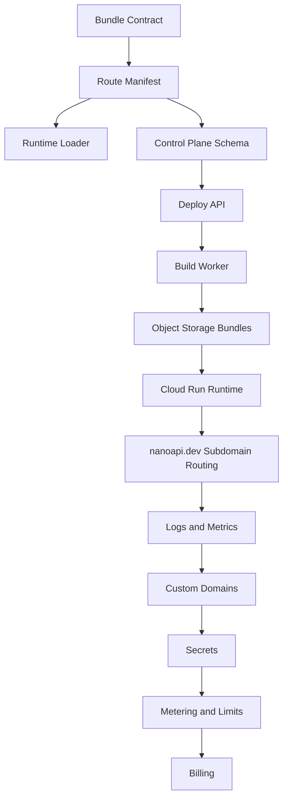

# Critical Infrastructure Build Plan

This plan assumes NanoAPI starts as a hosted GCP-backed platform while preserving a later bare-metal/self-hosted path.

## What We Already Have

The current repo already has the runtime foundations:

- Native Zig HTTP server.
- Fast route dispatch.
- Typed route helpers.
- Route metadata and OpenAPI generation.
- Middleware chain.
- Multipart and URL-encoded form parsing.
- Upload file representation.
- LLM-style streaming responses.
- Platform-neutral serverless invocation core.
- AWS HTTP API v2 adapter.
- Bench scripts and performance harnesses.

That means the first hosted-platform work should not be a dashboard or Kubernetes. It should be the platform contracts that let this runtime be built, deployed, routed, observed, metered, and rolled back.

## Critical Pieces

### 1. Deployment Bundle Contract

This is the most important missing contract.

Build:

- `nanoapi.manifest.json` generated at build time.
- Runtime binary or app shared object/WASM later.
- Static OpenAPI output.
- Build metadata: commit SHA, NanoAPI version, Zig version, target, build timestamp.
- Capability declarations: HTTP, streaming, upload, SSE, WebSocket, QUIC, background jobs.
- Required environment variables and secrets.

Why it matters:

- The control plane can deploy without inspecting source code.
- The runtime can load routes without asking Postgres on the hot path.
- Every provider adapter can consume the same package shape.

MVP output:

```text
bundle/
  nanoapi
  nanoapi.manifest.json
  openapi.json
  checksums.txt
```

### 2. Route Manifest Schema

The route manifest is what lets NanoAPI host many apps safely and quickly.

Build:

- Route method/path.
- Route name and tags.
- Path/query/body validation metadata.
- Middleware chain metadata.
- Streaming/upload capability flags.
- Auth policy hints.
- Rate-limit hints.
- OpenAPI operation IDs.

Runtime requirement:

- Load manifest into memory on startup or deployment switch.
- Host/domain lookup resolves to deployment ID.
- Deployment ID resolves to an in-memory route table.

Do not query Postgres per request.

### 3. Control Plane API

This is the source of truth for deployments and routing.

Build:

- Tenants.
- Users and memberships.
- Projects.
- Environments.
- Deployments.
- Custom domains.
- Secrets.
- Build jobs.
- Runtime instances.
- Usage events.
- Audit events.

First endpoints:

- `POST /projects`
- `POST /projects/:id/deployments`
- `GET /deployments/:id`
- `POST /domains`
- `GET /domains/:id`
- `POST /secrets`
- `GET /usage`

Use Postgres for metadata. Keep schema portable.

### 4. Build Worker

This turns source code into immutable runtime artifacts.

Build:

- Trigger from CLI or GitHub App.
- Pull source.
- Run `zig build test`.
- Run `zig build -Doptimize=ReleaseFast -Dtarget=x86_64-linux-musl`.
- Generate route manifest.
- Generate OpenAPI.
- Package bundle.
- Upload to Cloud Storage.
- Update deployment status.

GCP MVP:

- Cloud Run Job or Cloud Build.
- Artifact Registry for builder/runtime images.
- Cloud Storage bucket for bundles.
- Dedicated service account with minimal permissions.

### 5. Runtime Loader

This is the bridge between the hosted control plane and the fast native server.

Build:

- Runtime starts from a bundle path or deployment ID.
- Runtime downloads bundle from object storage.
- Runtime validates checksum/signature.
- Runtime loads route manifest.
- Runtime serves traffic from memory.
- Runtime exposes `/healthz`, `/readyz`, `/metrics`.
- Runtime can switch active deployment atomically.

Initial path:

- One Cloud Run service per environment or project class.
- Later: shared runtime pool that routes by host and deployment ID.

### 6. Custom Domain Manager

Custom domains are table stakes for paid plans.

Build:

- DNS verification records.
- Certificate Manager integration.
- Certificate map entry creation.
- Domain status state machine.
- Runtime host map refresh.
- Grace period on deletes.

GCP primitives:

- External Application Load Balancer.
- Certificate Manager.
- Certificate maps.
- Cloud DNS optional, but customers can use any DNS provider.

### 7. Secrets Manager

Hosted apps need secrets before they can be useful.

Build:

- Per-project and per-environment secrets.
- Encrypted metadata in Postgres.
- Secret values in GCP Secret Manager.
- Runtime injection through environment or mounted fetch path.
- Secret versioning.
- Audit logs for create/update/delete/reveal.

Never store secret plaintext in the control-plane database.

### 8. Observability

Customers need to debug production before we can charge seriously.

Build:

- Request logs.
- Build logs.
- Deployment events.
- Runtime health.
- Error counts.
- Latency histograms.
- Per-route request counts.
- Trace IDs propagated through middleware.

GCP MVP:

- Cloud Logging.
- Cloud Monitoring.
- OpenTelemetry.
- Export route-level counters from NanoAPI.

Customer-facing MVP:

- Deployment timeline.
- Last 1000 logs per service.
- Basic request count, error rate, p50/p95/p99 latency.

### 9. Metering And Limits

Pricing requires reliable metering before billing automation.

Build:

- Ingress request count.
- Outbound bytes.
- Build minutes.
- Artifact/upload storage bytes.
- Log retention bytes.
- Streaming duration later.
- WebSocket connection minutes later.

Implementation:

- Runtime emits usage events.
- Events go to Pub/Sub or Cloud Tasks.
- Aggregator writes hourly rollups to Postgres.
- Billing reads rollups, not raw request logs.
- Enforce soft and hard limits by plan.

### 10. CLI

A CLI is faster than building a polished dashboard first.

Build:

- `nano login`
- `nano init`
- `nano deploy`
- `nano domains add`
- `nano secrets set`
- `nano logs`
- `nano status`

The CLI can call the control plane and unblock early users before the dashboard is complete.

### 11. Auth And Tenancy

This prevents rewrites later.

Build:

- Workspace/tenant model.
- Project/environment boundaries.
- Roles: owner, admin, developer, viewer.
- API tokens.
- Service tokens for builders and runtimes.
- Audit log.

Do not rely on GCP IAM as the customer-facing auth model. Use GCP IAM internally for service accounts.

### 12. Billing Skeleton

Do not build full billing first, but do build the data shape.

Build:

- Plan table.
- Subscription table.
- Usage rollups.
- Entitlements.
- Spend caps.
- Manual invoice override.

Stripe can come after metering is trustworthy.

## First 30 Days

Goal: one app can deploy to NanoAPI hosted infra and serve traffic on a generated subdomain.

Build:

1. Bundle format and route manifest schema.
2. Runtime `--bundle` or `--manifest` loading path.
3. Cloud Run-compatible NanoAPI container image.
4. Cloud Storage bundle bucket.
5. Minimal control-plane DB schema.
6. Minimal control-plane API.
7. Build worker using Cloud Run Jobs or Cloud Build.
8. Generated `*.nanoapi.dev` routing.
9. Basic logs and health checks.
10. CLI deploy command.

Success criteria:

- `nano deploy` uploads source or build context.
- Build worker compiles and tests the app.
- Bundle lands in object storage.
- Control plane marks deployment active.
- Cloud Run runtime serves it at `project.nanoapi.dev`.
- Logs are visible.
- Rollback works.

## Days 31-60

Goal: charge-worthy beta.

Build:

1. Custom domains.
2. Secret management.
3. Usage metering.
4. Plan limits.
5. Build/deployment logs.
6. Preview environments.
7. Runtime metrics.
8. Request IDs and trace propagation.
9. Dashboard MVP.
10. Manual billing or Stripe test integration.

Success criteria:

- Customer can add `api.customer.com`.
- Customer can set secrets.
- Customer can deploy production and preview environments.
- Customer can view request count, errors, latency, logs, and build history.
- We can see usage by workspace.

## Days 61-90

Goal: reliable paid launch.

Build:

1. Stripe billing.
2. Spend caps and usage alerts.
3. Team roles.
4. Audit log.
5. Region selection.
6. Runtime pool autoscaling strategy.
7. Backup and restore runbook.
8. Incident runbook.
9. Status page.
10. Security review of builder isolation and secrets.

Success criteria:

- Paid plans work.
- Limits are enforced.
- A runtime deploy can be rolled back quickly.
- A control-plane DB restore has been tested.
- Builder cannot access other tenants' secrets or artifacts.

## Minimal GCP Resources

Create these first:

- GCP project for staging.
- Artifact Registry repository.
- Cloud Storage bucket for deployment bundles.
- Cloud Storage bucket for upload spooling if needed.
- Cloud Run service for control plane.
- Cloud Run service for runtime.
- Cloud Run Job or Cloud Build trigger for builds.
- Postgres: Cloud SQL or PlanetScale Postgres.
- Pub/Sub topic or Cloud Tasks queue for build jobs and usage events.
- Secret Manager.
- External Application Load Balancer.
- Certificate Manager.
- Cloud Logging and Monitoring.
- Service accounts:
  - control-plane service account.
  - builder service account.
  - runtime service account.
  - domain-manager service account.

## Build Order



## Do Not Build First

Defer these until the hosted MVP works:

- Full Kubernetes platform.
- BYOC.
- Multi-region active-active.
- Custom QUIC backend.
- Dedicated tenant runtimes.
- Perfect dashboard.
- Public marketplace.
- Complex billing experiments.
- Self-hosted installer.

## Immediate Next Issues To Create

- Define `nanoapi.manifest.json`.
- Add route manifest generation to `zig build`.
- Add runtime manifest loading.
- Add Cloud Run Dockerfile.
- Add minimal control-plane schema.
- Add deployment bundle upload/download.
- Add CLI `deploy`.
- Add GCP bootstrap Terraform or Pulumi.
- Add generated subdomain router.
- Add usage event emission.
